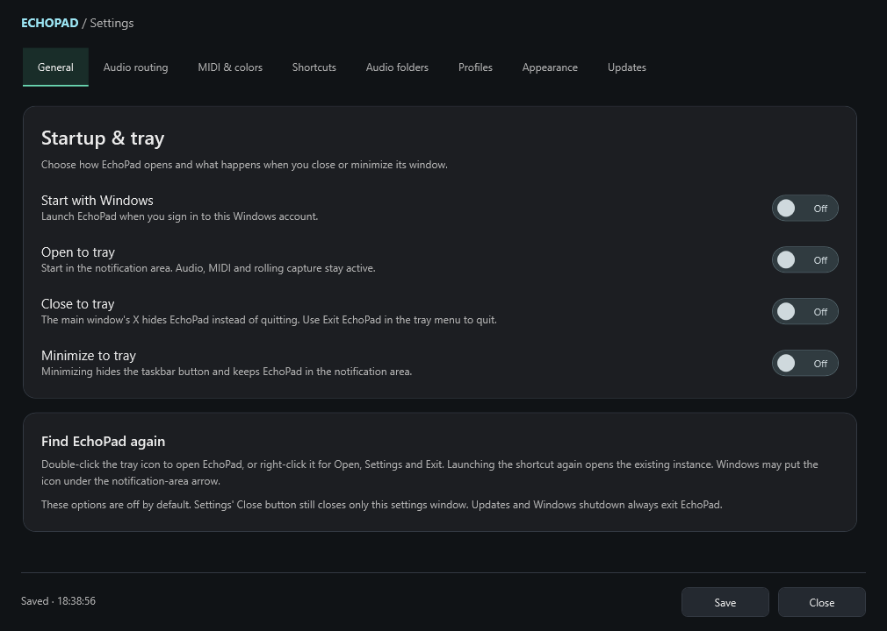

# EchoPad

EchoPad is a Windows audio pad sampler for live capture, sound clips, streaming and MIDI controllers. Its 4×4 grid can record the last **15 seconds** from either input, play imported audio, and route playback through local devices or VBAN.


## Unsigned Dev Release

Version **1.1.0-dev.20260929.3** adds Windows startup and tray controls in a new General tab, plus a dark installer using EchoPad's portrait waveform artwork and the ElkaSoft family layout. It includes automatic migration of older saves, installer downloads inside Settings, clearer pad states, profile names, improved hotkey/CC handling and PNG pad artwork. This is the normal local/VBAN application; the separate VST edition is future work.

Download the [Unsigned Dev Release](https://github.com/torment78/Echopad/releases/tag/v1.1.0-dev.20260929.3). Choose the Windows x64 installer or extract the complete self-contained ZIP and run `Echopad.App.exe`. This development release is unsigned and marked as a prerelease.

## New menus


Settings now has **General**, **Audio routing**, **MIDI & colors**, **Shortcuts**, **Audio folders**, **Profiles**, **Appearance**, and **Updates** tabs. Loaded pads show a stronger color across the whole surface. Rounded sliders independently adjust loaded fill, playing fill and outline intensity.



**General** offers Start with Windows, Open to tray, Close to tray and Minimize to tray. All four start off. Audio, MIDI and rolling capture keep running while the window is hidden. Double-click the tray icon to restore EchoPad; its menu offers Open, Settings and Exit. Launching the shortcut again restores the existing instance.


Each pad can have a stopped PNG and a playing PNG, with separate opacity and **Fit / Crop** settings. The waveform, trim controls and gain remain above the **Pad & routing**, **MIDI feedback**, and **Graphics** tabs.

## Guides

- [Illustrated setup and menu guide](docs/SETUP.md): every new tab, profile gestures, copying pads, PNGs and updates.
- [Application overview](docs/README.md): capture, playback, routing and saved data.
- [Development release notes and validation](docs/RELEASE-NOTES.md).
- [Regression checks](https://github.com/torment78/Echopad/blob/v1.1.0-dev.20260929.3/Echopad.Tests/README.md).
- [Install locations and migration](docs/MIGRATION.md).
- [Promotional graphics](graphics/README.md): portrait and landscape PNGs, plus a 373 KB horizontal preview.

## Build and test

The screenshots and guides describe the released development build. To build that exact version, use Windows and the .NET 10 SDK, and check out its release tag first:

```powershell
git fetch origin --tags
git switch --detach v1.1.0-dev.20260929.3
dotnet build Echopad.slnx -c Release
dotnet run --project Echopad.Tests -c Release
```

Build a tested, self-contained unsigned package with Inno Setup 6.6 or newer installed:

```powershell
./scripts/Build-UnsignedRelease.ps1 -Version 1.1.0-dev.20260929.3
```

Use `-SkipInstaller` for a ZIP-only package. Output is written under `artifacts/release/<version>`, with SHA-256 checksums. The script does not publish anything to GitHub.

The installer defaults to `C:\Program Files\ElkaSoft\EchoPad`. Settings, profiles, pad images and new captures live in `%LOCALAPPDATA%\ElkaSoft\EchoPad`, so normal saving requires no administrator rights. First launch copies older EchoPad data and updates the imported media references while retaining the originals. Existing destination settings are preserved. See [migration and backups](docs/MIGRATION.md) for the legacy locations and recovery details.
