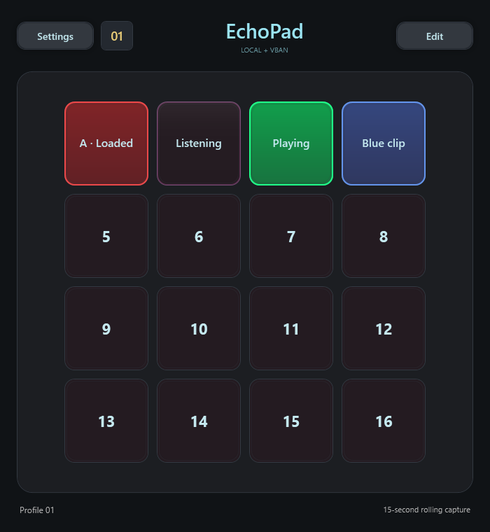
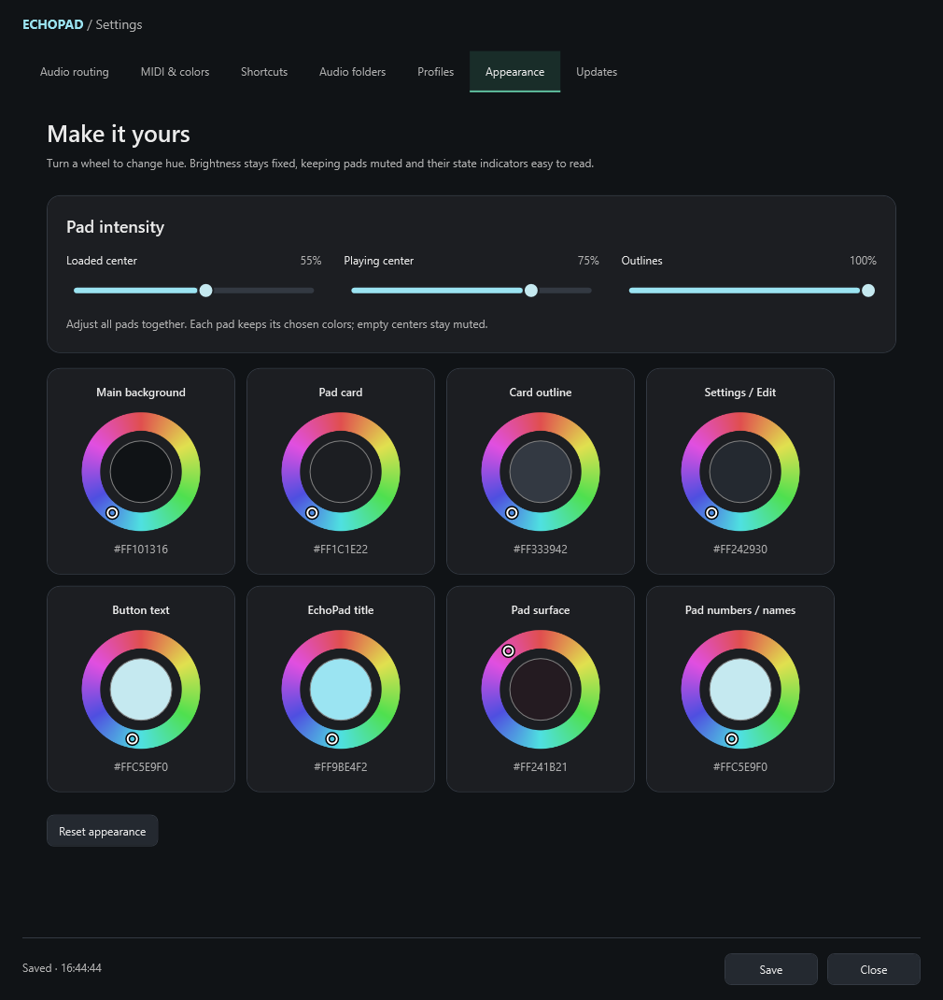
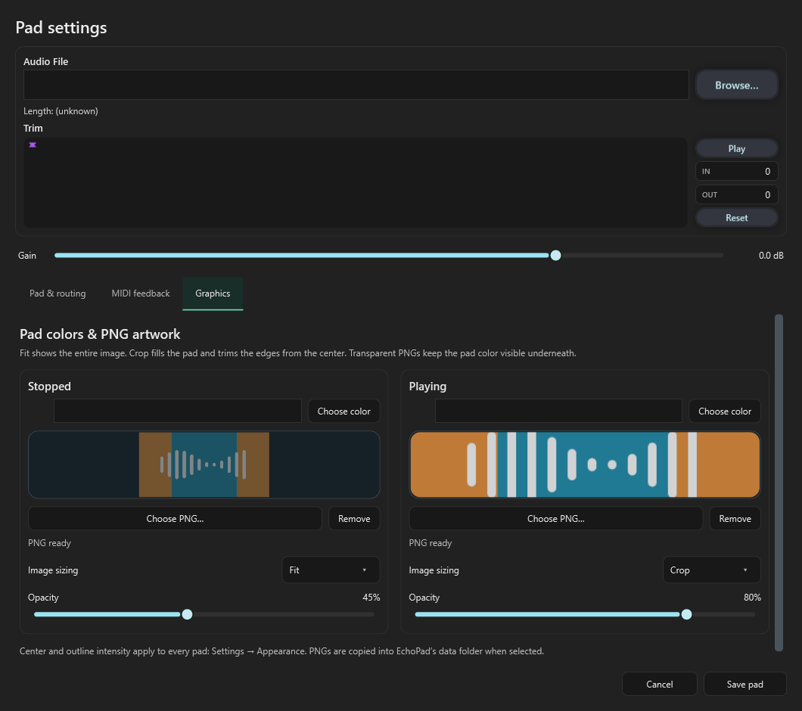

# EchoPad

EchoPad is a Windows audio pad sampler for live capture, sound clips, streaming and MIDI controllers. Its 4×4 grid can record the last **15 seconds** from either input, play imported audio, and route playback through local devices or VBAN.



## Unsigned Dev Release

Version **1.1.0-dev.20260929.1** introduces tabbed settings, clearer pad states, profile selection and naming, improved hotkey/CC handling, PNG pad artwork, appearance controls and a manual update checker. This is the normal local/VBAN application; the separate VST edition is future work.

Download development builds from [GitHub Releases](https://github.com/torment78/Echopad/releases). Choose the Windows x64 installer or extract the complete self-contained ZIP and run `Echopad.App.exe`. This development release is unsigned and marked as a prerelease.

## New menus



Settings now has **Audio routing**, **MIDI & colors**, **Shortcuts**, **Audio folders**, **Profiles**, **Appearance**, and **Updates** tabs. Loaded pads show a stronger color across the whole surface. Rounded sliders independently adjust loaded fill, playing fill and outline intensity.



Each pad can have a stopped PNG and a playing PNG, with separate opacity and **Fit / Crop** settings. The waveform, trim controls and gain remain above the **Pad & routing**, **MIDI feedback**, and **Graphics** tabs.

## Guides

- [Illustrated setup and menu guide](docs/SETUP.md): every new tab, profile gestures, copying pads, PNGs and updates.
- [Application overview](docs/README.md): capture, playback, routing and saved data.
- [Development release notes and validation](docs/RELEASE-NOTES.md).
- [Regression checks](Echopad.Tests/README.md).

## Build and test

Use Windows and the .NET 10 SDK:

```powershell
dotnet build Echopad.slnx -c Release
dotnet run --project Echopad.Tests -c Release
```

Build a tested, self-contained unsigned package with Inno Setup 6 installed:

```powershell
./scripts/Build-UnsignedRelease.ps1 -Version 1.1.0-dev.20260929.1
```

Use `-SkipInstaller` for a ZIP-only package. Output is written under `artifacts/release/<version>`, with SHA-256 checksums. The script does not publish anything to GitHub.

Settings, profiles and imported pad images live in `%LOCALAPPDATA%\Echopad`. Captures live in the user's Documents `Echopad\Captures` folder. Back up both locations and any separately referenced audio files before switching development builds.
