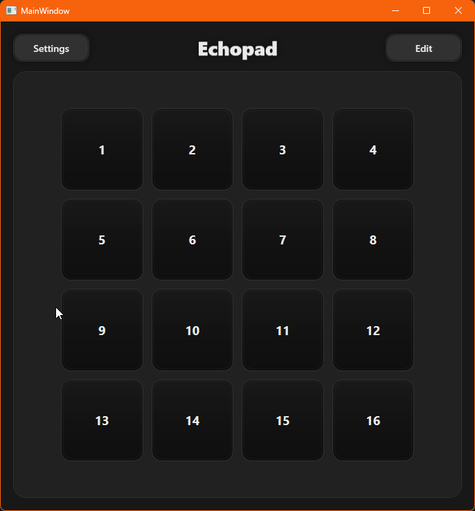

# 🎛️ Echopad

Echopad is a real-time audio pad sampler designed for **live performance, streaming and rapid audio interaction**.

It focuses on speed, predictability and minimal UI friction — no timelines, no tracks, no DAW-style complexity.

---

## 🧠 What Echopad Is

Echopad is built around a **4×4 pad grid**, where each pad represents an independent audio slot.

Each pad can:
- Play a loaded audio file
- Capture live audio using Echo mode
- Be triggered via mouse, keyboard or MIDI
- Provide MIDI LED feedback
- Store its own trim, input source and behavior

---

## 🖥️ Main Interface

The interface consists of:
- **Settings button** – global configuration
- **Edit toggle** – switches between Run Mode and Edit Mode
- **4×4 Pad Grid** – the main interaction surface

---

## 🔄 Pad States

Pads are state-driven.  
Visuals, behavior and MIDI feedback all follow the current pad state.

- **Empty** – no audio, no echo
- **Armed** – waiting to capture live audio
- **Loaded** – audio ready to play
- **Playing** – audio currently playing

This state model keeps Echopad predictable during live use.

---

## ✍️ Edit Mode vs Run Mode

### Run Mode
- Pads trigger audio
- MIDI bindings are active
- Intended for live performance

### Edit Mode
- Assign audio files
- Enable Echo Mode or Drop Folder Mode
- Adjust trims
- Open per-pad settings

Configuration changes are only possible in Edit Mode.

---

## 🎙️ Echo Mode (Live Capture)

Echo Mode continuously buffers live audio from an input source.

When an **armed, empty pad** is triggered:
- The last buffered audio is written to disk
- The file is assigned to the pad
- The pad instantly becomes Loaded

This allows:
- Instant replays
- Voice capture
- Live stream sound effects
- Reactive sampling

Echo Mode works with both **local audio devices** and **network-based audio sources** (see VBAN below).

---

## 🌐 VBAN Audio Routing (Network Audio)

Echopad supports **VBAN audio streaming**, allowing audio to be routed **over the network** instead of using only local devices.

VBAN can be used on:
- **Audio Inputs** (VBAN Receive)
- **Audio Outputs** (VBAN Transmit)

This makes Echopad suitable for:
- Multi-PC streaming setups
- Remote audio capture
- Network-based monitoring
- Routing audio between applications or machines

### VBAN Inputs
An input can be set to **VBAN** instead of Local.

In this mode:
- Echopad listens on a UDP port
- Receives audio from a VBAN sender
- Feeds the stream into Echo Mode and live meters

### VBAN Outputs
An output can be set to **VBAN** instead of Local.

In this mode:
- Pad playback is streamed as VBAN audio
- Audio is sent in real time over UDP
- Sample rate and channel count follow the source material

Local and VBAN routing can be mixed freely:
- Local input → VBAN output
- VBAN input → Local output
- VBAN input → VBAN output

Switching modes is handled live and safely.

---

## 📁 Drop Folder Mode

Pads can be configured to watch a folder.

When a new audio file appears:
- It is automatically assigned to the next eligible pad

Useful for:
- Drag-and-drop workflows
- External automation
- Companion tools

---

## 🎹 MIDI Support

Echopad supports:
- MIDI input (Notes, CC, Program Change)
- Per-pad MIDI learn
- Global MIDI actions
- MIDI output for LED feedback

Each pad can reflect:
- Active state
- Playing state
- Cleared state
- Armed (input-specific LED values)

This allows tight integration with MIDI controllers.

---

## 💾 Settings & Portability

All settings are stored in a single file:

echopad.settings.json

Key properties:
- Stored next to the executable
- No registry usage
- Fully portable
- Safe to back up or move between machines

---

## 📘 Documentation

- **SETUP.md** – full setup and usage guide
- **README.md** – overview and concepts

---

## 🚧 Status

- Core functionality stable
- VBAN routing fully implemented and tested
- Actively developed
- Installer planned (Inno Setup)

Echopad is designed to grow without breaking existing workflows.
