# 🛠️ Echopad – Setup & Usage Guide

This guide covers first-time setup, per-pad configuration, and everyday usage — including **local audio** and **VBAN (network audio)** routing.

Follow the steps in order.

---

## 1️⃣ Audio Setup

Open **Settings → Audio**.

Echopad supports **per-channel audio routing**, allowing each input, output, and monitor path to be switched independently between:

- **Local** (WASAPI devices)
- **VBAN** (UDP network audio)

This makes it possible to mix and match local and network audio freely.

---

## 🔀 Audio Inputs – Local vs VBAN

### Input Audio Mode Switch

Each input (Input 1 and Input 2) has a **mode selector** directly under the input label:

- **Local**  
  Uses a local WASAPI audio device (microphones, sound cards, virtual drivers, etc.)

- **VBAN**  
  Receives audio over the network via VBAN (UDP)

Switching modes instantly changes how Echopad captures live audio for Echo Mode.

---

### Audio Inputs (Local Mode)

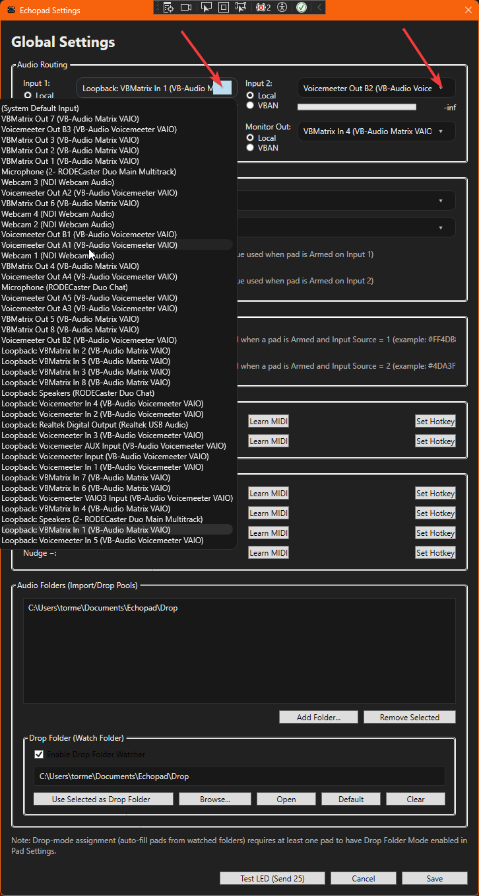

When **Local** is selected:

- Choose a local audio input device
- Used by Echo Mode and per-pad capture
- Supports microphones, interfaces, virtual cables, etc.

---

### Audio Inputs (VBAN Mode)

When **VBAN** is selected, the local device list is replaced with VBAN connection fields:

- **IP Address** – sender IP (or `0.0.0.0` to accept any)
- **Port** – UDP port
- **Stream Name** – VBAN stream identifier

This allows Echopad to capture audio sent from:
- Another PC
- A mixer
- OBS / Voicemeeter / other VBAN-capable apps

---

## 🔊 Main Output – Local vs VBAN

### Main Output Audio Mode Switch

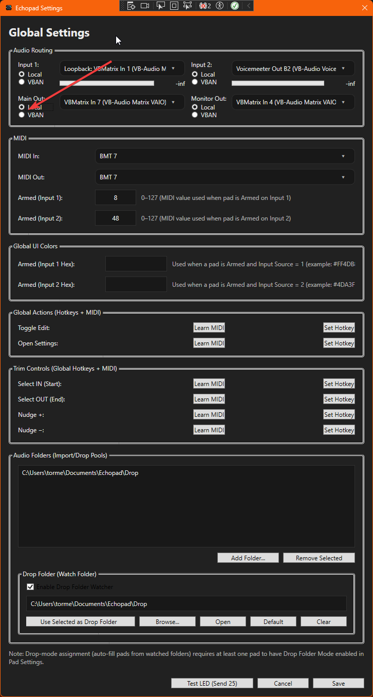

The **Main Output** can also be switched between:

- **Local** – normal playback device
- **VBAN** – network audio transmission

---

### Main Output (Local Mode)

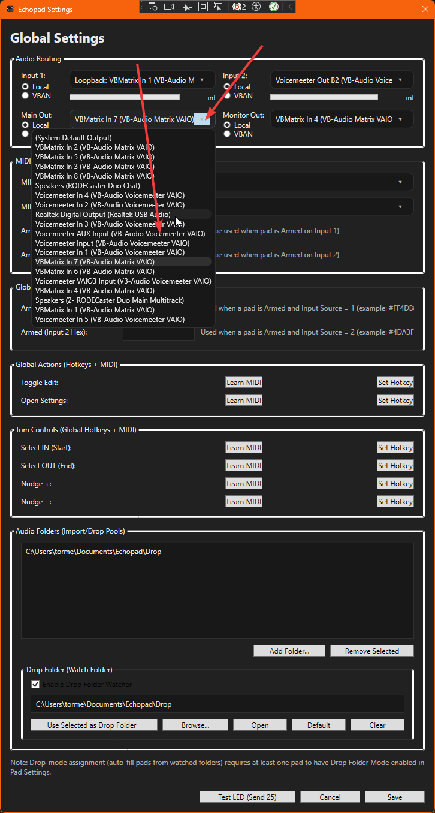

- Select the main playback device
- Pads play here during Run Mode

---

### Main Output (VBAN Mode)

When set to **VBAN**, Echopad sends pad audio over the network.

Configure:
- **IP Address** – receiving device
- **Port** – UDP port
- **Stream Name** – VBAN stream name

This enables:
- Streaming audio to another machine
- Feeding a remote mixer
- Network-based performance setups

---

## 🎧 Monitoring Output – Local vs VBAN

### Monitor Audio Mode Switch

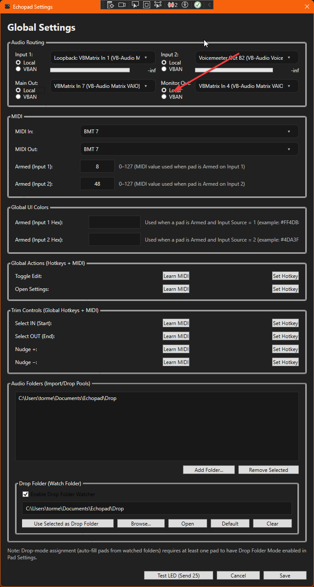

The **Monitoring Output** (used for previews in Edit Mode) also supports:

- **Local** monitoring
- **VBAN** monitoring

---

### Monitoring Output (Local Mode)

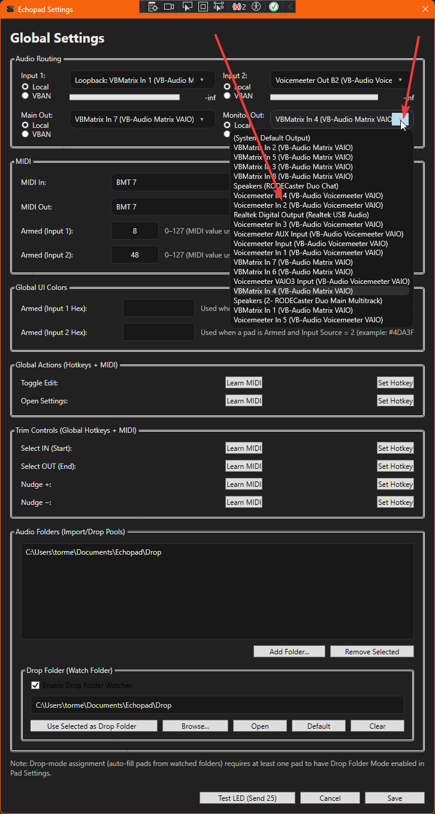

- Optional preview output
- Used when previewing pads in Edit Mode

---

### Monitoring Output (VBAN Mode)

In **VBAN** mode, preview audio is sent over the network instead of to a local device.

This is useful for:
- Remote cue monitoring
- Headless systems
- Distributed setups

---

## 🌐 VBAN In / Out / Monitoring Overview

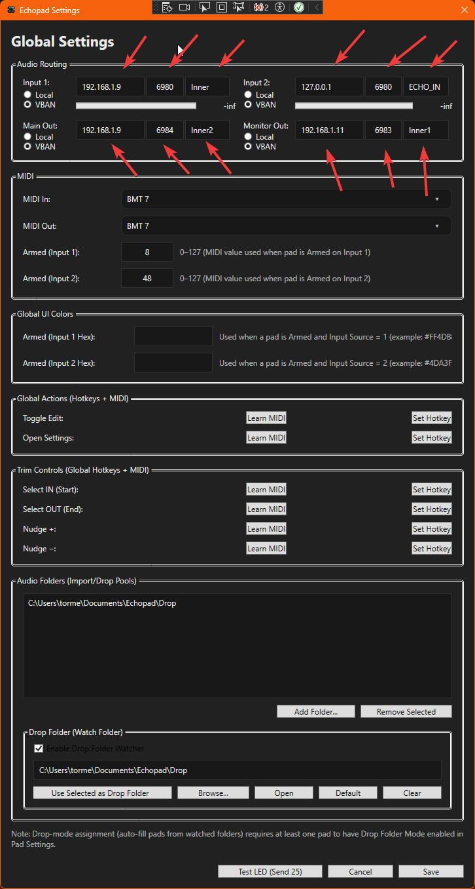

When VBAN is enabled, each channel shows its own IP, port, and stream fields.

Key points:
- Inputs receive audio
- Outputs send audio
- Monitoring can be independent
- All paths are configured separately

---

## 🔀 Mixing Local and VBAN (Advanced)

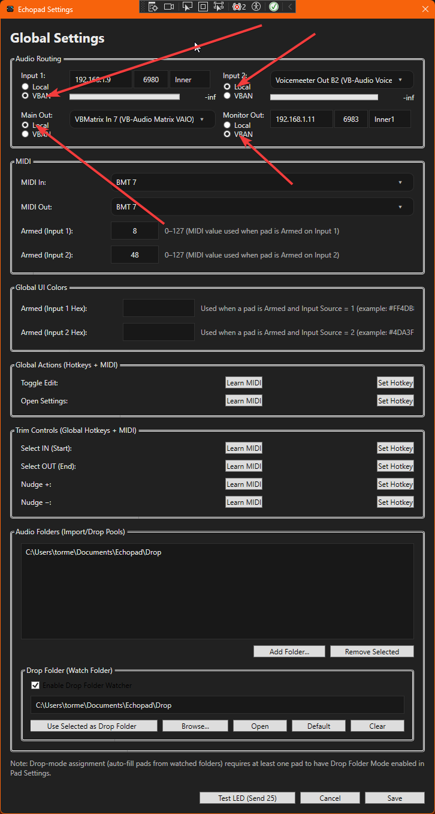

Echopad allows **full mix-and-match routing**, for example:

- Capture from **VBAN**, play out **locally**
- Capture from **local mic**, send to **VBAN**
- Monitor locally while outputting to VBAN
- Monitor via VBAN while outputting locally

There are **no restrictions** forcing all channels to use the same mode.

---

## 2️⃣ MIDI Setup

Open **Settings → MIDI**.

### MIDI Input

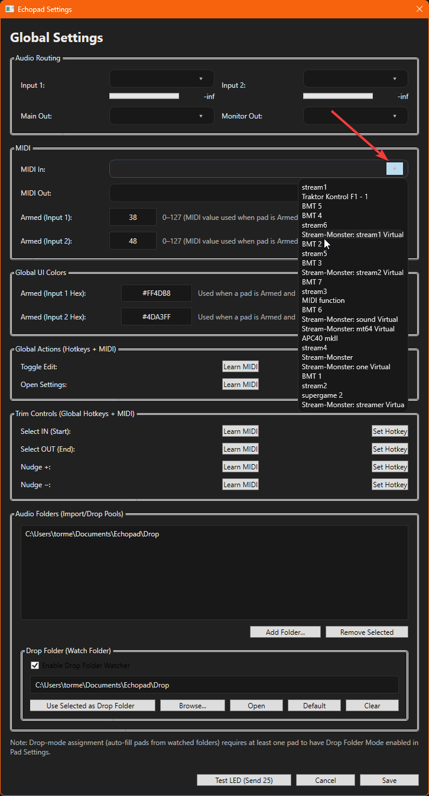

- Select your MIDI controller
- This device triggers pads and global actions

---

### MIDI Output (LED Feedback)

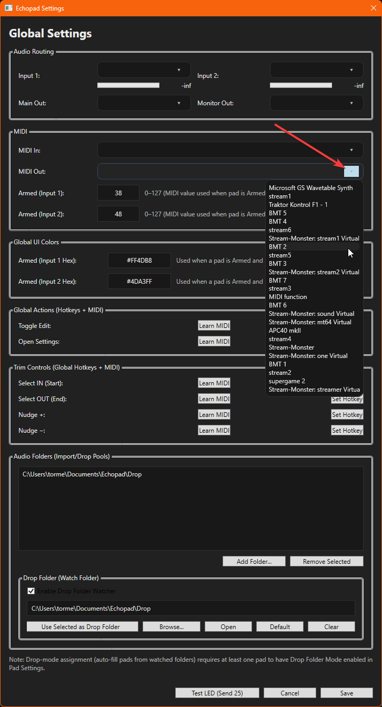

- Optional but recommended
- Sends pad state back to the controller
- Enables LED feedback for pad states

---

## 3️⃣ Enter Edit Mode

Click the **Edit** button in the top bar.

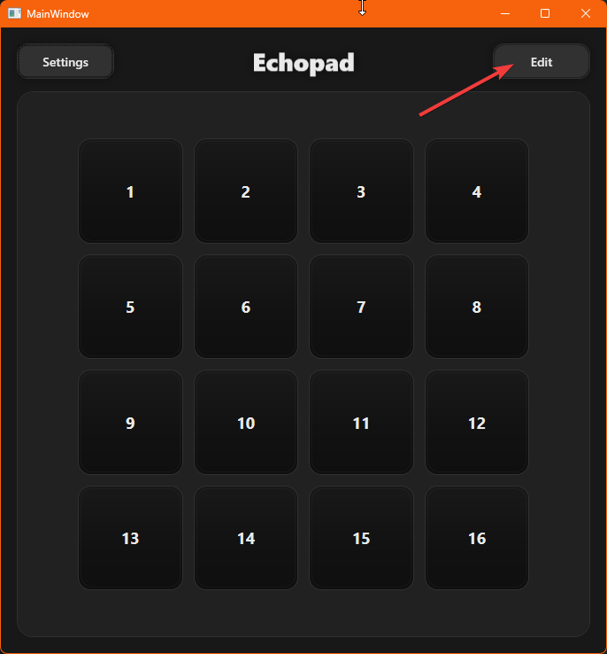

Edit Mode enables configuration instead of playback.

---

## 4️⃣ Edit Mode Active

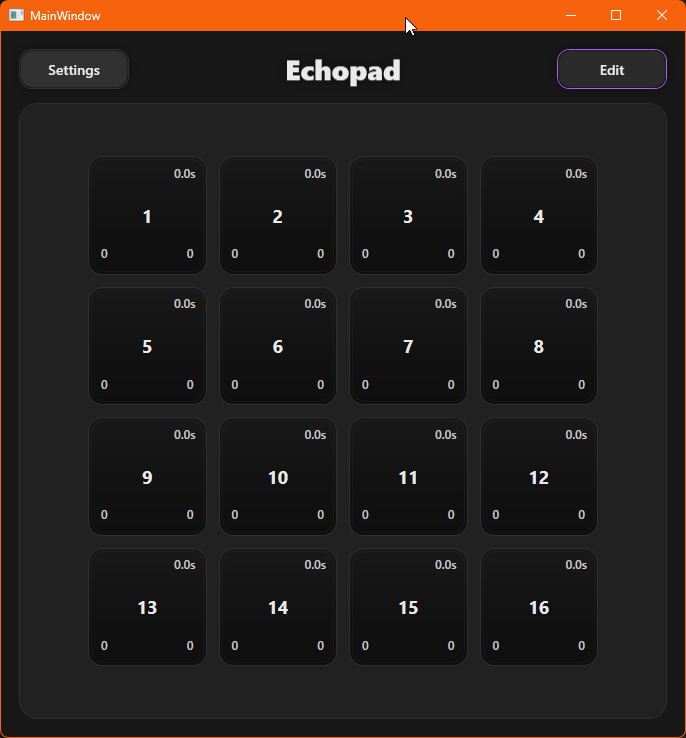

When Edit Mode is active:
- Pads no longer play audio
- Pads open configuration instead

---

## 5️⃣ Open Per-Pad Settings

Right-click any pad while in Edit Mode.

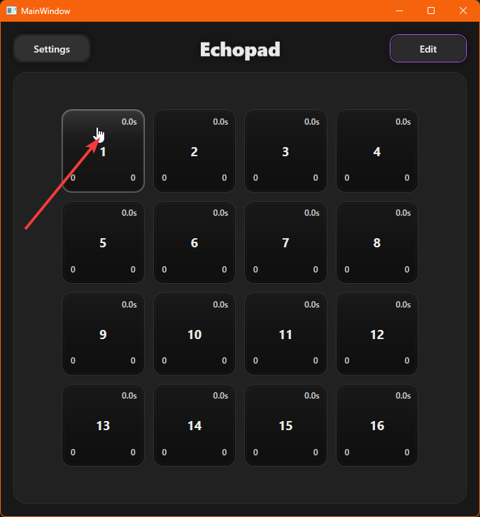

This opens the per-pad settings window.

---

## 6️⃣ Per-Pad Settings – Audio & Input

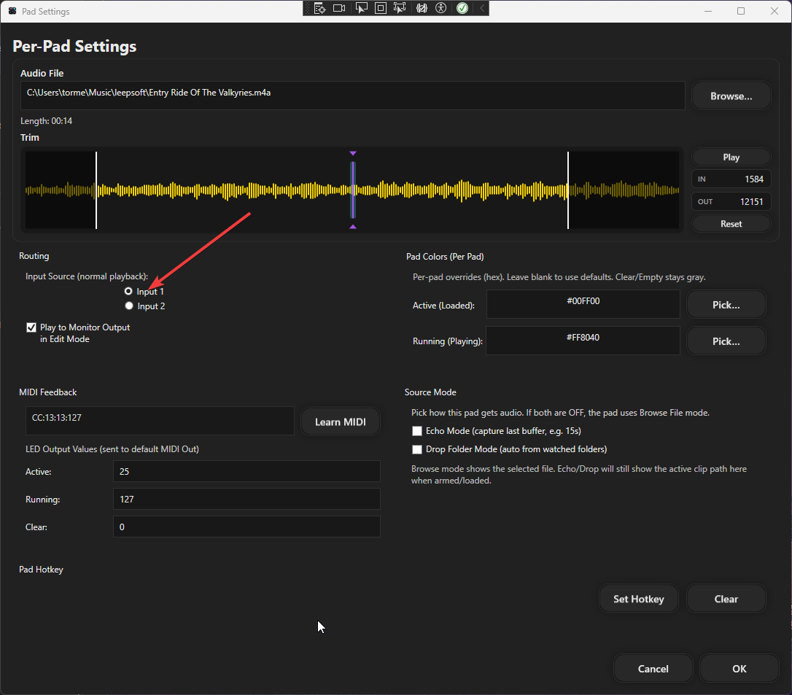

From here you can:
- Assign an audio file
- Select Input 1 or Input 2
- Define which input Echo Mode captures from

Input selection respects **Local / VBAN mode** chosen in global settings.

---

## 7️⃣ Per-Pad Settings – Echo & Drop Folder

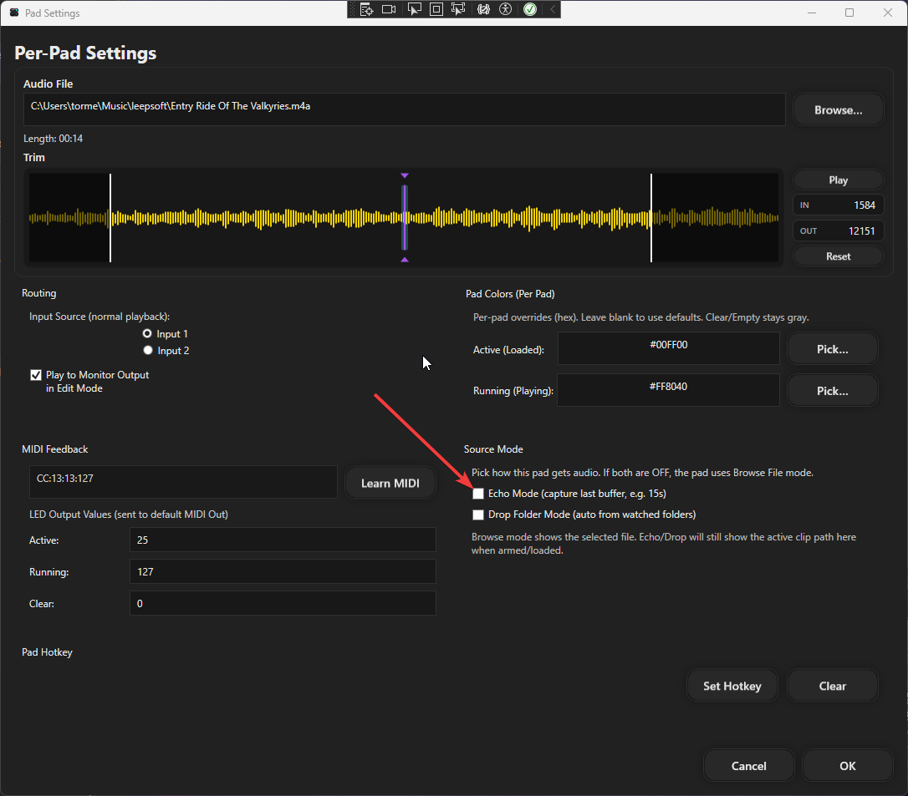

Options include:
- **Echo Mode** – enables live capture
- **Drop Folder Mode** – auto-assign files from a folder

---

## 8️⃣ Trimming Audio (Edit Mode)

Hover over trim values and use the mouse wheel.

### Trim In

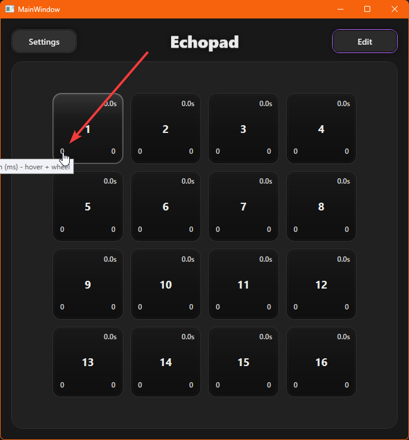

Adjusts the playback start position.

---

### Trim Out

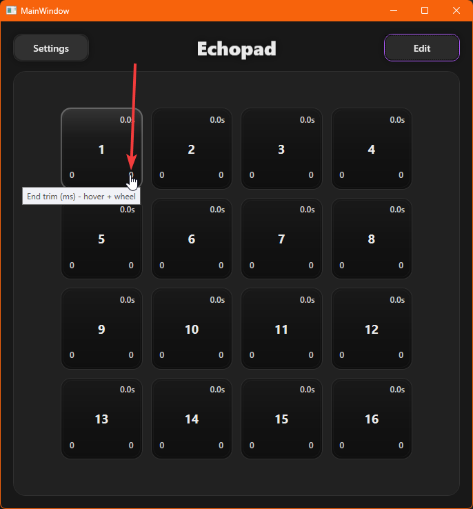

Adjusts the playback end position.

---

## 9️⃣ Run Mode Usage

Exit Edit Mode.

Pads now:
- Play audio
- Capture live audio if armed
- Respond to MIDI and keyboard triggers
- Route audio according to Local / VBAN settings

---

## 🔁 Typical Workflow

1. Configure audio inputs, outputs, and monitoring (Local or VBAN)
2. Configure MIDI
3. Enter Edit Mode
4. Configure pads and Echo Mode
5. Trim audio if needed
6. Exit Edit Mode
7. Perform live

---

## 💾 Settings Persistence

All configuration is saved automatically to:

echopad.settings.json

No manual saving is required.

---

## ✅ Setup Complete

Echopad is now ready for:
- Local performance
- Networked audio workflows
- Hybrid VBAN + local setups
- Live streaming and capture
