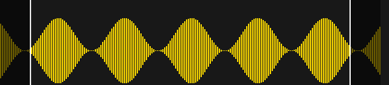

# EchoPad setup and menu guide

This guide covers **1.1.0-dev.20260929.1 — Unsigned Dev Release**. Images are renders of the real WPF controls using example settings, generated by the regression harness. Device names and meter levels in these examples are simulated. The orange update image demonstrates the available-update state.

## Start with audio routing

Open **Settings → Audio routing**. Choose **Input 1**, **Input 2**, **Main output** or **Monitor output** in the left column.

Each route has a Local card and a VBAN card. Turn on the one you want; enabling either switches the other off. Both may be off without losing their configuration. Input 1 and Input 2 each maintain a 15-second rolling buffer. The vertical meters show the active source level and hold recent peaks.

For Local input, select a microphone, interface or loopback device. For VBAN, set the remote address, UDP port and stream name to match the sender. The stream name must contain 1–16 ASCII characters. VBAN sends audio over your network; it requires another application or device that supports VBAN.

**Main output** carries normal pad playback. **Monitor output** is the destination for private previews in pad setup and for pads configured to use the monitor in Edit mode. Select headphones or a separate VBAN stream for the monitor. Confirm its routing in your mixer so previews are not sent to your audience.

Local and VBAN can be mixed between routes. Each route uses one transport at a time.

## MIDI and input colors

Choose the MIDI input for triggers and the MIDI output for controller LEDs. Input-specific armed colors distinguish pads buffering Input 1 from those buffering Input 2. Click **Choose color** for the palette; hex fields remain available for exact values. MIDI LED values and on-screen colors are separate settings.

Use the MIDI test control to check the selected output with your controller. Select the correct MIDI ports before using Learn elsewhere.

## Keyboard and MIDI shortcuts

Click a binding field or **Learn** to assign a control. **×** clears it. Keyboard capture supports combinations such as Ctrl+Shift+F12, Ctrl+Alt+A and Shift+Alt+F2. These keyboard shortcuts operate while EchoPad is active.

The page contains Toggle Edit mode, Open settings, Select trim IN, Select trim OUT, and positive/negative 10 ms trim nudges. Trim actions affect the last selected pad in Edit mode.

MIDI Learn accepts notes and CC controls. A CC activates when it crosses the learned threshold; keeping it above that threshold does not repeatedly trigger it. Dropping below the threshold allows another press. The binding display hides raw diagnostic suffixes to keep the control readable.

## Audio folders

Add folders to the import library with **Add folder**. Remove an entry with **Remove selected**.

For automatic assignment, choose the **Drop folder** and turn it on. **Use selected library folder** reuses a listed folder, **Open folder** opens it in Explorer, **Default** selects the default Documents location, and **Clear** disables the watcher and clears its path. Pads must have Drop Folder mode enabled to receive new files. Imported audio is assigned to an eligible pad; PNG files belong in the pad Graphics tab instead.

## Profiles

There are 16 profile slots. In **Settings → Profiles**, configure the global profile modifiers and pad MIDI linking, then name and bind each slot. Search by profile name or number to find a slot quickly.

A slot containing only a key uses the global keyboard modifiers. A complete shortcut such as Ctrl+Alt+F1 works directly. MIDI slot switching uses the selected held MIDI control, if one is assigned. Pad MIDI linking can share MIDI alone, or MIDI and hotkeys, from Profile 1; independent bindings remain saved for when linking is turned off.

Use the small profile-number button beside Settings:

| Gesture | Result |
| --- | --- |
| Ctrl+left-click | Move to the next profile |
| Shift+left-click | Open the profile dropdown |
| Right-click | Open the Profiles settings tab |

Settings changes are saved automatically. **Save** writes the current settings and keeps the window open; **Close** saves and closes it. Invalid values must be corrected first.

## Pad setup: waveform and routing

Turn on **Edit** and right-click a pad to open its setup.

The audio file, waveform, Play/Pause, trim IN/OUT, Reset and gain remain above the tabs. Double-click the gain slider to reset it to 0 dB. **Save pad** commits the pad settings; **Cancel** discards pending settings changes.

In **Pad & routing**, enter a name, choose an input, configure monitor playback, and assign the pad hotkey and MIDI trigger.

Choose the source behavior:

- **Echo** captures the current 15-second rolling buffer when an empty armed pad is triggered. The next trigger plays the captured clip.
- **Drop folder** receives new audio from the configured watched folder.
- Leave both off to load audio with **Browse**.

## Pad MIDI feedback

Set controller LED output values for Loaded/stopped, Playing and Cleared/empty. Enter 0–127, or **OFF** to disable that state. Entering a number enables it again. Raw MIDI messages such as `90 3C 7F` are also supported for controllers that need them. Feedback uses the MIDI output selected in global Settings.

## Pad PNGs and colors

The **Graphics** tab has separate Stopped and Playing controls. Choose their colors using the palette, or leave the hex field blank to use the default.

For each state, choose a PNG, select **Fit** or **Crop**, and adjust its opacity:

- **Fit** keeps the whole image visible at its original aspect ratio.
- **Crop** fills the pad, trimming the edges from the center.
- **Opacity** affects only the artwork; pad text and state outlines stay visible.
- **Remove** clears that state's image assignment.

Square images such as 1000×1000 and rectangular images such as 4:3 are supported. PNG transparency is preserved. Files must be under 25 MB with dimensions up to 8192×8192. EchoPad keeps its own copy, so moving the original image will not break the pad. Changing Fit, Crop or opacity leaves the original PNG untouched.

Stopped artwork appears whenever the pad is not playing, including empty/armed pads. If the current state has no image, its normal pad surface is shown.

## Overall appearance and pad visibility

**Settings → Appearance** controls the main background, pad card, card outline, Settings/Edit buttons, button text, EchoPad title, pad surface and pad names/numbers. Hue wheels keep a controlled brightness.

Three rounded sliders adjust all pads together: **Loaded center**, **Playing center**, and **Outlines**. The first two control the strength of the pad's state-color tint. The outline slider controls the bright state rings. Empty pad centers remain subdued. **Reset appearance** restores the global defaults.

## Copy a pad to several destinations

In Edit mode, hold Ctrl and click the source pad. Its yellow outline marks the selection. Keep holding Ctrl and click each target pad to copy the audio assignment, name, trim, gain, colors and artwork. Target routing, hotkeys and MIDI triggers remain independent.

Release Ctrl, press Escape, leave Edit mode or switch away from the window to end the copy gesture.

## Check for updates

Open **Settings → Updates** and click **Check for updates**. EchoPad checks public GitHub releases only when you ask. If a newer eligible release exists, the button turns orange and the release name and version appear.

**Open release page** opens GitHub in your browser. Download and install when ready; checking does not install or restart the app. Development builds include newer development releases in their checks; stable builds check stable releases. Offline, rate-limit and unreadable-feed results are reported as errors, not as “up to date.”

## Saved data and backups

Settings, profiles and imported PNG copies live in `%LOCALAPPDATA%\Echopad`: `echopad.settings.json`, `profiles.json` and `PadImages`. Captures live in Documents under `Echopad\Captures`. Audio loaded from elsewhere remains referenced at its original path.

Back up settings, profiles, PadImages, captures and any external audio together. Stored image/audio paths are absolute; moving the backup to a different Windows user or computer can require reselecting those files. This ZIP build shares the normal EchoPad data folder and is not an isolated portable profile.
